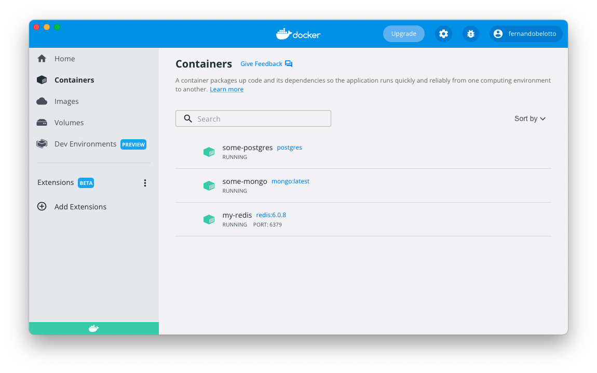

# Instalando o docker


## Porque usar o docker?

Imagine que eu quero rodar um aplicativo que você construiu no seu computador.
Seu aplicativo foi construido com node. Se eu tenho um aplicativo que precisa do nodejs, se eu não tiver o nodejs instalado no meu sistema operacional, eu não posso executar esse app.
Ou seja, antes de poder executar o programa eu vou precisar instalar o node. Para resolver essa questão, podemos usar o docker para executar esse aplicativo dentro de um container.
Dessa forma, temos uma forma mais fácil de executar qualquer programa.
Assim conseguimos executar aplicações que muitas vezes não podem ser executadas diretamente no sistema operacional por necessitarem de dependencias que não estão disponíveis no so.
Dessa forma eu posso criar um container que possuí a versão do node que eu preciso e executar o aplicativo dentro desse container.

## O que é o docker?

Copiando do site opensource.com:

**Docker é uma plataforma para construir, executar e gerenciar containers em servidores e na nuvem.**



Do site do docker temos:
Docker ajuda os desenvolvedores a dar vida às suas idéias, conquistando a complexidade do desenvolvimento de aplicativos. Simplificamos e aceleramos os fluxos de trabalho de desenvolvimento com um pipeline de desenvolvimento integrado e através da consolidação de componentes de aplicação. Ativamente utilizado por milhões de desenvolvedores em todo o mundo, Docker Desktop e Docker Hub proporcionam simplicidade, agilidade e escolhas inigualáveis.

## O que é um container?

Um **contêiner é uma unidade padrão de software que empacota o código e todas as suas dependências para que a aplicação seja executada** de forma rápida e confiável de um ambiente de computação para outro. Uma imagem de container Docker é um pacote de software leve, autônomo e executável que inclui tudo o que é necessário para executar uma aplicação: código, tempo de execução, ferramentas de sistema, bibliotecas de sistema e configurações.

## Como instalar o docker?

Veja o sistema operacional que você está usando para instalar o docker.

### MacOS

Instale o docker no MacOS no link: **[https://docs.docker.com/docker-for-mac/install/](https://docs.docker.com/docker-for-mac/install/).**

### Windows

Veja o link para instalar no windows: **[https://docs.docker.com/docker-for-windows/install/](https://docs.docker.com/docker-for-windows/install/)**

### Linux

Rode o comando abaixo para instalar o docker.

```bash
sudo apt-get install docker.io
```
