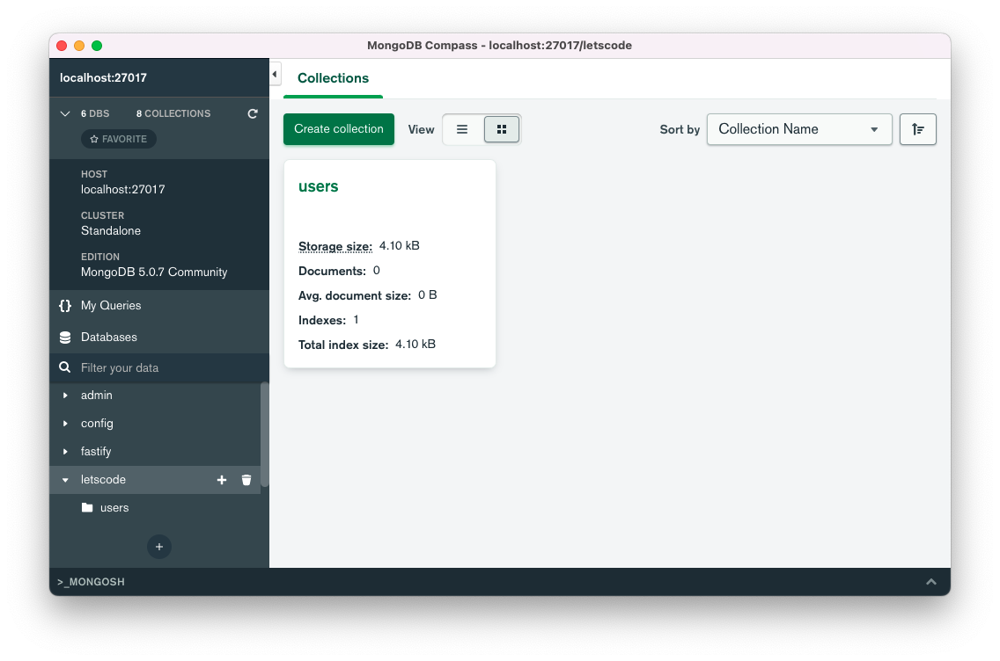

# Node + Mongo

Para conectar o node com o mongo vamos usar o docker para facilitar o processo, já que só instalando o docker conseguimos iniciar o mongo sem a necessidade de instalá-lo.

## Passo a passo

1. Instale o docker na sua máquina usando o primeiro tutorial nessa sessão.

1. Instale o mongo compass (uma ferramenta para gerenciar mongodb) **[nesse link](https://www.mongodb.com/download-center/compass)**



1. Para iniciar o docker abra seu terminal e execute o comando a seguir. Ele vai criar um container do docker, que vai rodar o mongo.

   ```
   docker run --name some-mongo -d mongo:latest
   ```

1. Depois, para se conectar ao mongo usando a cli dele, abra o terminal e execute o comando a seguir.

   ```
   docker exec -it some-mongo mongo
   ```

1. Agora vamos ver as databases que temos

      ````
      show dbs
      ````

1. Vamos criar uma database chamada letscode:

      ````
      use letscode
      ````

1. Pronto, agora temos uma database, com uma tabela e uma entry nessa tabela. Vamos ao código!

      ```
      db.users.insertOne({
         name: "John",
         age: 30,
         city: "New York",
         state: "NY",
         country: "USA",
         address: {
            street: "Wall Street",
            zip: "10001",
            building: "1A",
         },
         categories: ["books", "movies", "music", "games"],
      })
      ```

1. Para verificar agora com a coleção criada com um objeto, rode o comando:

      ````
      db.users.find().pretty()
      ````

1. Perfeito, vamos ao código agora!