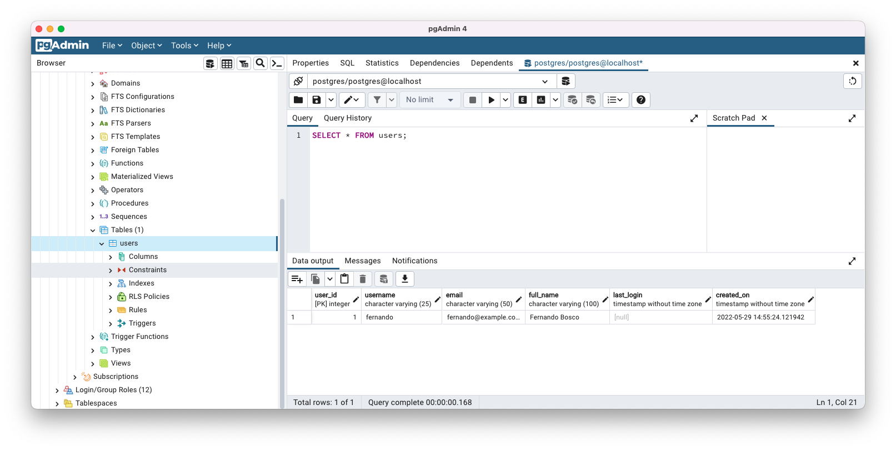

# Node + PostgreSQL

Para facilitar a sua vida em realizar esse tutorial vamos usar o docker, já que só instalando o docker conseguimos iniciar o postgresql sem a necessidade de instalar.

## Passo a passo

1. Instale o docker na sua máquina usando o primeiro tutorial nessa sessão.

1. **[ Opcional ]** Caso você queira um software para interagir com a sua database, instale o [pgAdmin4](https://www.pgadmin.org/download/).



1. Para iniciar o docker abra seu terminal e execute o comando a seguir. Ele vai criar um container do docker, que vai rodar o postgre.

   ```
   docker run --name some-postgres -e POSTGRES_PASSWORD=postgrespw -d postgres
   ```

1. depois, para se conectar ao postgre, abra o terminal e execute o comando a seguir.

   ```
   docker exec -it some-postgres psql -U postgres
   ```

1. Agora vamos criar uma database e depois uma tabela. Rode na sequencia:

   ```
   CREATE DATABASE letscode;
   ```

1. Agora rode para criar uma tabela de usuários

   ```
   CREATE TABLE users (
     user_id INTEGER PRIMARY KEY GENERATED ALWAYS AS IDENTITY,
     username VARCHAR ( 25 ) UNIQUE NOT NULL,
     email VARCHAR ( 50 ) UNIQUE NOT NULL,
     full_name VARCHAR ( 100 ) NOT NULL,
     last_login TIMESTAMP,
     created_on TIMESTAMP NOT NULL
   );
   ```

1. Agora vamos inserir um usuário nessa tabela rodando o comando

   ```
   INSERT INTO users (username, email, full_name, created_on) VALUES ('fernando', 'fernando@example.com', 'Fernando Bosco', NOW());
   ```

1. Só para teste e verificação, vamos verificar o usuário inserido, rode:

   ```
   SELECT * FROM users;
   ```

1. pronto, agora temos uma database, com uma tabela e uma entry nessa tabela. Vamos ao código!
