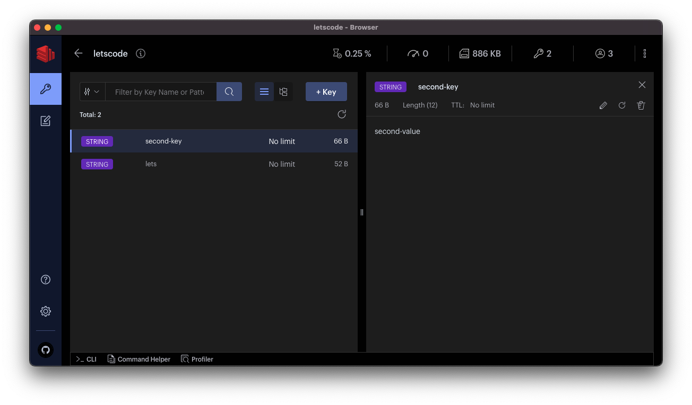

# Node + Redis

Para isso vamos usar o docker para facilitar o processo, já que só instalando o docker conseguimos iniciar o postgre sem a necessidade de instalar.

## Passo a passo

1. Instale o docker na sua máquina usando o primeiro tutorial nessa sessão.

1. **[ Opicional ]** Caso tenha interesse, instale o software RedisInsightv2 [nesse link](https://redis.com/redis-enterprise/redis-insight/)



1. Para iniciar o docker abra seu terminal e execute o comando a seguir. Ele vai criar um container do docker, que vai rodar o postgre.

   ```bash
      docker run -dit --rm --name=my-redis -p 6379:6379 redis:6.0.8
   ```

1. **Opcional** Caso você queira interagir com o container, execute o comando abaixo.

   ```bash
      docker exec -it my-redis bash
   ```

1. Agora que temos o redis rodando, podemos ir para o código!!